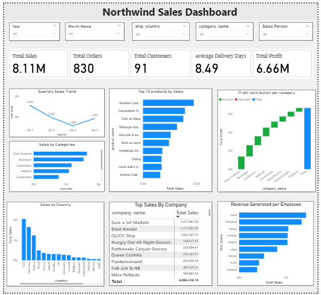
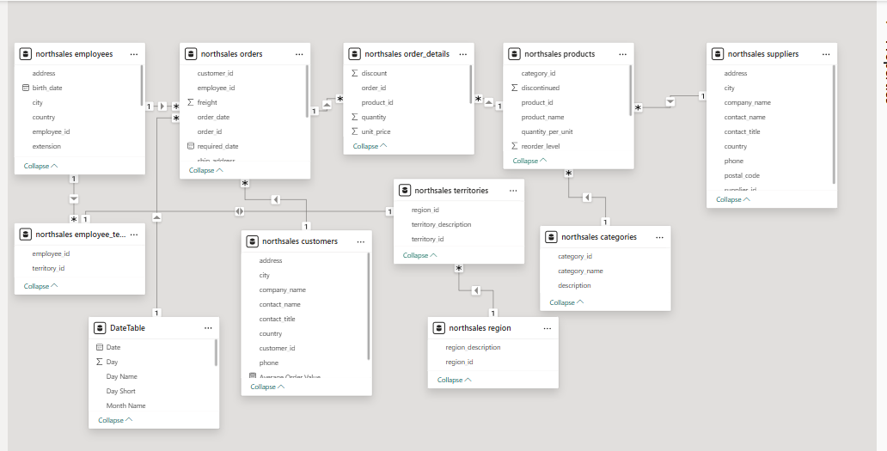

# 📊 Northwind Sales Analysis – Power BI Project

<p align="center">
  
</p>


---

## 📌 Project Overview
This project analyzes **Northwind database** sales data using **Power BI** to uncover insights into sales, profit, orders, and delivery performance.  
The database is hosted locally on **SQL Server** and consists of multiple relational tables.

**Main Tables:**
- `categories`
- `customer_customer_demo`
- `customer_demographics`
- `customers`
- `employee_territories`
- `employees`
- `order_details`
- `orders`
- `products`
- `region`
- `shippers`
- `suppliers`
- `territories`

---

## 🔌 Data Connection & Transformation
- Connected Power BI to the **local SQL Server**.
- Used **Power Query** for:
  - Checking column quality.
  - Dropping unnecessary columns.
  - Applying necessary transformations.
- Loaded the cleaned data into **Power BI** for modeling and analysis.

---

## 🗂 Data Modeling
- Created relationships between tables for accurate reporting.
- Built a **Date Table** for time-based analysis.
- Developed **DAX measures** to calculate KPIs.



---

## 📏 Key Measures

### **Average Delivery Days**
```DAX
Average Delivery Days = 
AVERAGEX(
    'northsales orders',
    DATEDIFF(
        'northsales orders'[order_date],
        'northsales orders'[shipped_date],
        DAY
    )
)
```

### Total Profit
```DAX
Total Profit = 
SUMX(
    'northsales order_details',
    (
        ('northsales order_details'[unit_price] * (1 - 'northsales order_details'[discount]))
        + RELATED('northsales orders'[freight])  -- add freight per order
        - RELATED('northsales products'[unit_price])
    )
    * 'northsales order_details'[quantity]
)
```
### Total Sales
```DAX
Total Sales = 
SUMX(
    'northsales order_details',
    'northsales order_details'[quantity] *
    (
        'northsales order_details'[unit_price] * (1 - 'northsales order_details'[discount])
        + RELATED('northsales orders'[freight])
    )
)
```
### Total Orders
```DAX

Total Orders = DISTINCTCOUNT('northsales order_details'[order_id])
```

## 📊 Key Insights

- **Total Sales:** $8.11 USD  
- **Total Orders:** 830  
- **Total Customers:** 91  
- **Average Delivery Time:** 8.49 days  
- **Total Profit:** $6.66 million USD  
- **Top Countries by Sales:** USA, Germany, Austria, Brazil, France  
- **Best Performing Employees:** Janet, Margaret, Nancy  

---

## 📈 Dashboard & Visualizations

The interactive dashboard includes:
- **Total Sales** by product, category, and region.
- **Total Profit** breakdown.
- **Average Delivery Days** visualization.
- **Total Orders** trend over time.
- **Slicers & Filters** for dynamic exploration.

---

## ☁️ Publishing

The final report was **published to the Power BI Service**, enabling:
- Online access from anywhere.
- Sharing with stakeholders.
- Automated data refresh schedules.

---

## 🏆 Skills Demonstrated

- Connecting Power BI to **SQL Server**
- Data cleaning & transformation with **Power Query**
- Data modeling & relationships
- **DAX** for KPI creation
- Dashboard design & storytelling
- Publishing to **Power BI Service**
